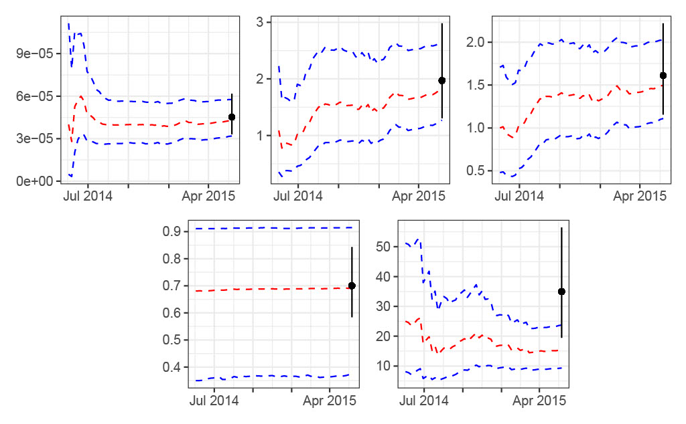
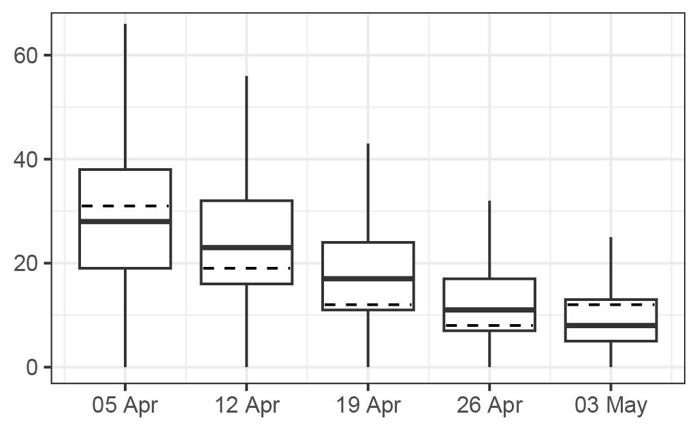

# Ebola application
Here you will find the code for replicating the Ebola application.

ebolaData.csv - Weekly incidence counts of Ebola in Seirra Leone spanning  

ebolaInf.r - Functions for inference for Ebola application via particle filter

ebolaForecast.r - Function to perform forecasting for Ebola application using particle filter output

ebolaRun.r - Code to run particle filter and produce forecasts

## Key plots

*Means (red) and 95% credible intervals (blue) for model parameters through time.*

*Five one-step-ahead forecasts for last five (non-zero) observations (using particle filter output). Observed values overlaid as dotted lines.*